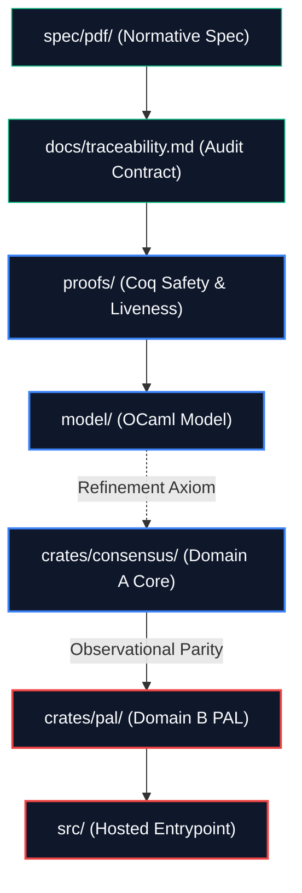

# QASH Protocol

<p align="center">
  <a href="file:///home/debian/Downloads/QASH/qash/LICENSE"></a>
  <a href="file:///home/debian/Downloads/QASH/qash/rust-toolchain.toml"></a>
  
  
</p>

---

## 🔮 What QASH Is

QASH is a **deterministic replicated transition calculus** with post-quantum cryptographic anchoring and formally machine-checkable safety properties.

> [!IMPORTANT]
> ### The Central Architectural Invariant
> **Identical replay produces identical state.**
> All subsystems, protocols, and runtimes are strictly subordinate to this guarantee.



### 🧭 Design Characteristics

* **Replay-Verifiable Execution**: Serialization is ontology. Two states that encode identically are the exact same state.
* **Determinism Core**: Complete absence of nondeterministic iteration, wall-clock time, hardware entropy, or floating-point math in consensus.
* **Mathematical Safety**: Safety properties are intended to be machine-provable from explicit axioms.

| QASH is **NOT** ❌ | QASH **IS** 🚀 |
| :--- | :--- |
| A probabilistic consensus chain | A deterministic replicated state machine |
| A Nakamoto-style longest-chain system | A replay-verifiable execution environment |
| A validator lottery or leader election | A formally constrained transition system |
| A speculative execution virtual machine | A protocol where serialization is ontology |

---

## 🔐 Genesis Lock Status

> [!WARNING]
> **Pre-lock Stage**: `QASH_Spec_v1.0.pdf` has not yet been committed to `spec/pdf/`. All quotes, page references, and requirement traces in [docs/traceability.md](file:///home/debian/Downloads/QASH/qash/docs/traceability.md), `docs/errata/`, and `docs/adr/` are **provisional** until the PDF is committed and the genesis hash is recomputed. See [spec/pdf/README.md](file:///home/debian/Downloads/QASH/qash/spec/pdf/README.md) for the lock procedure.

---

## 📁 Repository Structure

* [spec/pdf/](file:///home/debian/Downloads/QASH/qash/spec/pdf/) — Normative PDF source of truth (v1.0, checked in before genesis lock).
* [docs/traceability.md](file:///home/debian/Downloads/QASH/qash/docs/traceability.md) — PDF requirement → code → test → proof contract mapping.
* [docs/errata/](file:///home/debian/Downloads/QASH/qash/docs/errata/) — Normative corrections/clarifications to the PDF.
* [docs/adr/](file:///home/debian/Downloads/QASH/qash/docs/adr/) — Architecture Decision Records (ADRs) for engineering decisions.
* [docs/spec/](file:///home/debian/Downloads/QASH/qash/docs/spec/) — Pre-existing derived engineering specs.
  * [00_execution_model.md](file:///home/debian/Downloads/QASH/qash/docs/spec/00_execution_model.md) — Deterministic execution substrate.
  * [01_consensus.md](file:///home/debian/Downloads/QASH/qash/docs/spec/01_consensus.md) — State space, encoding, and transition function.
  * [07_hash_cascade.md](file:///home/debian/Downloads/QASH/qash/docs/spec/07_hash_cascade.md) — Depth-7 cryptographic hash cascade.
  * [12_sharded_protocol.md](file:///home/debian/Downloads/QASH/qash/docs/spec/12_sharded_protocol.md) — Cross-shard receipts and sharded protocol details.
* [proofs/](file:///home/debian/Downloads/QASH/qash/proofs/) — Formal Coq theorems and proof obligations.
* [model/](file:///home/debian/Downloads/QASH/qash/model/) — Canonical executable semantics (extracted from proofs).
* [crates/](file:///home/debian/Downloads/QASH/qash/crates/) — Core implementation source.
  * [crates/consensus/](file:///home/debian/Downloads/QASH/qash/crates/consensus/) — `no_std` deterministic consensus core (**Domain A**).
  * [crates/pal/](file:///home/debian/Downloads/QASH/qash/crates/pal/) — Platform Abstraction Layer (**Domain B**).
* [src/](file:///home/debian/Downloads/QASH/qash/src/) — Hosted entrypoint binary.
* [GENESIS_CONSTANTS.toml](file:///home/debian/Downloads/QASH/qash/GENESIS_CONSTANTS.toml) — Immutable parameters defining genesis block state (unlocked).
* [docs/platforms/authorized_platform_matrix.md](docs/platforms/authorized_platform_matrix.md) — Authorised platform universe: Tier A genesis-blocking, Tier A+ advisory ISA, Tier B hosted OS, Tier C RTOS, Tier D accelerator/hardware evidence profiles and evidence-gating rules.
  * [docs/platforms/rtos_portability_plan.md](docs/platforms/rtos_portability_plan.md) — RTOS portability strategy (ITRON, FreeRTOS, Zephyr, RTEMS, seL4, AUTOSAR, VxWorks, QNX, INTEGRITY).
  * [docs/platforms/accelerator_profiles.md](docs/platforms/accelerator_profiles.md) — GPU compute and hardware security/attestation evidence profiles (MUSA, CUDA, ROCm, TPM, HSM, TEE, SGX).
* [docs/audit/pre_genesis_audit_plan.md](docs/audit/pre_genesis_audit_plan.md) — Pre-genesis full-repo audit plan: 10 phases, gating model, CI workflow split, negative test protocol.
  * [docs/audit/unsafe_exceptions.md](docs/audit/unsafe_exceptions.md) — Unsafe code exception register (Domain B only; Domain A has zero tolerance).
  * [docs/audit/dependency_risk_register.md](docs/audit/dependency_risk_register.md) — Dependency risk triage register (required before genesis-lock).

> [!NOTE]
> **Runtime Status**: Integration scaffold. The hosted PAL replay, commitment transport, attestation interfaces, sharded replay, and ZK boundaries exist. Production networking, hardware attestation, and Plonky3 verifications are not yet deployed.
>
> **MVP Claim Boundary**: The offline incident-receipt commit demonstrator is a local Domain B MVP only. Allowed and blocked claims are governed by the [claims register](file:///home/debian/Downloads/QASH/qash/docs/mvp/claims_register.md). Refer to [incident_receipt_commit_demo.md](file:///home/debian/Downloads/QASH/qash/docs/mvp/incident_receipt_commit_demo.md) for more details.
>
> **Handoff evidence**: Current pre-genesis claims are tracked in [docs/release/pre_genesis_evidence_snapshot.md](file:///home/debian/Downloads/QASH/qash/docs/release/pre_genesis_evidence_snapshot.md).

---

## 📊 Theorem & Verification Status

QASH tracks all formal properties within the [proof coverage map](file:///home/debian/Downloads/QASH/qash/proofs/COVERAGE.md).

### Summary of Proof Coverage

| Status | Count | Meaning |
| :--- | :---: | :--- |
| **PROVED** | **35** | Coq theorem compiled under `coqc` with zero `Admitted` markers. |
| **CI-VERIFIED** | **4** | Verified via cross-ISA CI or KAT test vectors. |
| **AXIOM** | **3** | Documented foundational assumption (e.g. hash collision resistance). |
| **PLACEHOLDER** | **2** | Target formulation defined, final mathematical reduction deferred. |
| **Total** | **44** | **Verified protocol assertions.** |

### Key Core Theorems

| ID | Name | Class | Status | Proof File |
|:---|:---|:---:|:---:|:---|
| **TH-1** | Encoding injectivity | Safety | ✅ PROVED | [encode_injectivity.v](file:///home/debian/Downloads/QASH/qash/proofs/contractivity/encode_injectivity.v) |
| **TH-2** | Encoding totality | Safety | ✅ PROVED | [encode_injectivity.v](file:///home/debian/Downloads/QASH/qash/proofs/contractivity/encode_injectivity.v) |
| **TH-3** | Convergence decrease / halt gate | Liveness | ✅ PROVED | [lyapunov_stability.v](file:///home/debian/Downloads/QASH/qash/proofs/contractivity/lyapunov_stability.v) |
| **TH-4** | $\Phi_{\text{safety}}$ monotonicity | Safety | ✅ PROVED | [absorbing_halt.v](file:///home/debian/Downloads/QASH/qash/proofs/safety/absorbing_halt.v) |
| **TH-5** | $\Phi_{\text{safety}}$ boundedness | Safety | ✅ PROVED | [absorbing_halt.v](file:///home/debian/Downloads/QASH/qash/proofs/safety/absorbing_halt.v) |
| **TH-6** | Halt correctness | Safety | ✅ PROVED | [absorbing_halt.v](file:///home/debian/Downloads/QASH/qash/proofs/safety/absorbing_halt.v) |
| **TH-7** | Replay invariance RT-1 | Determinism | ✅ CI-VERIFIED | [replay_corpus.rs](file:///home/debian/Downloads/QASH/qash/tests/replay_corpus.rs) (x86_64, aarch64, riscv64gc) |
| **TH-8** | Succession soundness | Safety | ✅ PROVED | [th8_composition.v](file:///home/debian/Downloads/QASH/qash/proofs/integration/th8_composition.v) |
| **RT-1..4** | Coq ↔ Rust Observational Refinement | Refinement | ✅ PROVED | [RefinementStatement.v](file:///home/debian/Downloads/QASH/qash/proofs/model/RefinementStatement.v) |
| **V1.1 FP** | Causal Fingerprint & Trace Determinism | Safety | ✅ PROVED | [causal_fingerprint.v](file:///home/debian/Downloads/QASH/qash/proofs/safety/causal_fingerprint.v) |
| **V1.1 SL** | Skip-List Confluence & Compression | Confluence | ✅ PROVED | [lyapunov_confluence.v](file:///home/debian/Downloads/QASH/qash/proofs/composition/lyapunov_confluence.v) |
| **V1.1 ORD** | Lexicographical Causal Ordering | Liveness | ✅ PROVED | [causal_ordering.v](file:///home/debian/Downloads/QASH/qash/proofs/ordering/causal_ordering.v) |
| **Sharding** | EFB determinism and receipt anchoring | Sharding | ✅ SCAFFOLDED | [efb_determinism.v](file:///home/debian/Downloads/QASH/qash/proofs/sharding/efb_determinism.v) |

---

## ⚡ Sharding and ZK Profile Status (v1.2)

Sharding is protocol structure, not an optional implementation module.

* **State Commitment & EFB**: The current implementation includes deterministic shard assignment, cross-shard receipt generation, and EFB (Equivalent Fee Boundary) aggregation rooted in the `PublicTranscript`.
* **Provisional ZK Profile**: Plonky3 FRI-STARK with Poseidon inside the circuit and QASH-native outer commitments.
* **Recursion Structure**:
  * **Layer 0**: Shard validity verification.
  * **Layer 1**: 16:1 shard aggregation.
  * **Layer 2**: Global EFB root verification.
* **Partition of Labor**: Domain A validates the public proof structure shape and commits to `zk_batch_root`; Domain B owns proof generation, transport, and the verifier backend.

---

## 🛠️ Local Verification Setup

To install local tools used by Rust, Coq, Kani, and the cross-compile/fuzz runners:

```bash
scripts/install_test_dependencies.sh
```

### 💻 Build & Test Commands

```bash
# Build the workspace
cargo build --workspace

# Run the complete test suite (with all PAL features enabled)
cargo test --workspace --all-features

# Test the deterministic consensus core (Domain A)
cargo test -p qash-consensus --no-default-features

# Compile all formal Coq proofs
make -C proofs all

# Run supply-chain security and license policy audits
cargo deny check

# Check for whitespace issues before committing
git diff --check
```

---

## 🧑‍💻 Contributing Rules

QASH implementation discipline is closer to **kernel development** or **avionics software** than conventional web3 development.

### 🚫 Forbidden in Domain A (`crates/consensus/`):
* Floating-point types (`f32`, `f64`).
* Platform-dependent widths (`usize`/`isize`) except for local array indexing.
* Unchecked arithmetic (use checked operations routing to `absorbing_reset`).
* Nondeterministic containers (`HashMap`, `HashSet`).
* Wall-clocks or direct OS entropy.
* `unsafe` code blocks.
* `panic!`, `unwrap`, or `expect`.

### 🛡️ Permitted in Domain B (`crates/pal/`):
* `unsafe` blocks under formal audit.
* OS networking, clocks, entropy, and file I/O.
* Hardware acceleration (SIMD, CPU features).
* Dynamic allocation.

> [!CAUTION]
> No Domain B value may ever flow into or influence a Domain A computation.

---

## 📝 Spec Version Binding

The spec version is content-addressed:
$$\text{spec\_hash} = \text{SHA3-256}(\text{00\_execution\_model.md} \parallel \text{01\_consensus.md})$$
This hash is recorded in `GENESIS_CONSTANTS.toml` at genesis lock. The runtime checks the spec hash it implements, and any mismatch will fail CI.

---

## 📚 Patent Evidence Pack

The repository includes a patent-support evidence structure for technical review with counsel. These materials are not legal advice. They organize evidence around candidate invention families:
* Deterministic replay isolation architecture.
* Lyapunov-based validator stability evaluation.
* Cross-ISA deterministic reproducibility enforcement.

Start at [patents/README.md](file:///home/debian/Downloads/QASH/qash/patents/README.md). Replay evidence is archived under `artifacts/replay_equivalence/`, and performance measurements are under `artifacts/benchmarks/`.

---

<details>
<summary><b>🔍 PR #93 Review Integration & Gap Matrix (Click to expand)</b></summary>

### PR #93 Review Status
PR #93 review feedback is incorporated through curated repository artifacts. Protocol material extracted from the review belongs in `docs/spec/`, `docs/adr/`, [ROADMAP.md](file:///home/debian/Downloads/QASH/qash/ROADMAP.md), [PROJECT_STATUS.md](file:///home/debian/Downloads/QASH/qash/PROJECT_STATUS.md), tests, and proofs. The CI `document-hygiene` job rejects raw transcript dumps.

### PR #93 Gap Matrix (Draft Review vs Current Repo)

| PR #93 Comment Theme | Already Incorporated | Gap / Required Follow-up |
| :--- | :--- | :--- |
| **Sharding must be protocol structure** | [12_sharded_protocol.md](file:///home/debian/Downloads/QASH/qash/docs/spec/12_sharded_protocol.md), `crates/consensus/src/sharding.rs`, v1.2 vectors | Expand cross-ISA hosted replay evidence for sharded whole-protocol traces. |
| **ZK profile must be fixed and auditable** | Plonky3 FRI-STARK + Poseidon-in-circuit + QASH commitments. | Implement production Plonky3 verifier backend in Domain B with profile-lock tests. |
| **Runtime hot-path inefficiencies** | ADR-006 and Phase 2-R scheduling with parity preconditions exist. | Execute Phase 2-R implementation behind strict consensus-byte parity gates. |
| **Raw transcripts are not specs** | CI document-hygiene checks and PR template guards. | Keep enforcing canonical placement (`docs/spec`, `docs/adr`, proofs, tests). |
| **Performance claims must be evidenced**| Precondition tests + bench compilation gates exist. | Publish tx-heavy and commit-path benchmark artifacts before finality claims. |

### Planned Future Work
1. **Phase 2-R implementation** (single-pass admission, deterministic total-order sorting, streaming root hashing, runtime `ProjectedView`).
2. **Profile-locked Plonky3 verifier backend in PAL** (Domain B only, no Domain A semantic influence).
3. **Cross-ISA hosted replay evidence expansion** for sharded whole-protocol traces.
4. **Benchmark publication discipline** under `artifacts/benchmarks/`.

</details>

---

<details>
<summary><b>🛡️ Certification-Grade Delivery Path & Roadmap (Click to expand)</b></summary>

### Assurance Objectives
1. **Deterministic Safety Objective**: Identical admissible replay yields identical state roots across authorized ISAs.
2. **Semantic Correctness Objective**: Rust consensus behavior is observationally equivalent to canonical model semantics.
3. **Cryptographic Boundary Objective**: Every cryptographic claim is either formally proved, reduced to an explicit axiom, or marked as deferred with bounded blast radius.
4. **Build Integrity Objective**: Reproducible, byte-identical builds from pinned environments.
5. **Operational Robustness Objective**: PAL/runtime faults cannot silently perturb Domain A state transitions.

### Phase-by-Phase Roadmap

#### Phase 1 — Pre-Genesis Assurance Closure (Blocking for lock)
* **P1.1 Formal obligation closure**: Complete deferred proof tracks listed in [proofs/COVERAGE.md](file:///home/debian/Downloads/QASH/qash/proofs/COVERAGE.md).
* **P1.2 Domain A deep audits**: Invariant audits of `fixed_point.rs`, `encoding.rs`, `lyapunov.rs`, `hash.rs`, and `transaction.rs`.
* **P1.3 Fuzz and adversarial closure**: Continuously run fuzz targets covering fixed-point boundaries, encoding/decode roundtrips, and transaction admissibility.
* **P1.4 Genesis lock readiness gate**: Normative PDF committed, traceability links reconciled, cross-ISA replay vectors green.

#### Phase 2 — Operational Hardening (Deployment Precondition)
* **P2.1 PAL host implementation controls**: Implement persistent storage with crash-safe WAL semantics and explicit failure handling.
* **P2.2 Integration and fault-injection testing**: Validate that Domain B does not perturb Domain A state roots under restart and crash recovery.
* **P2.3 Performance characterization**: Measure worst-case epoch transition time and replay latency distribution.

#### Phase 3 — Assurance Hardening (Independent Auditability)
* **P3.1 Proof-to-code refinement**: Strengthen formal linkage between `Model.v` and `crates/consensus`.
* **P3.2 Multi-compiler differential verification**: Execute deterministic replay corpus across multiple compiler/backend configurations.
* **P3.3 Trusted computing base minimization**: Document and reduce trust assumptions.

</details>

---

*QASH is licensed GPL-3.0-or-later.*
*`GENESIS_CONSTANTS.toml` will be immutable after genesis lock.*
